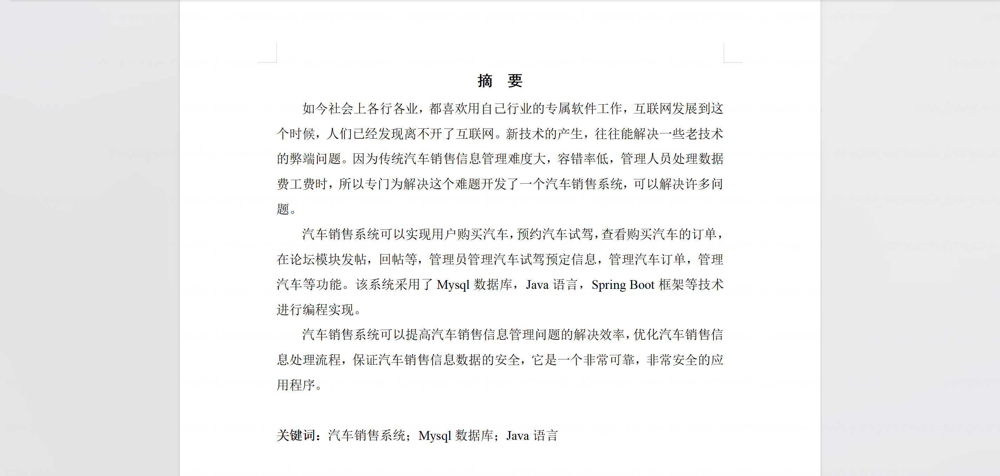
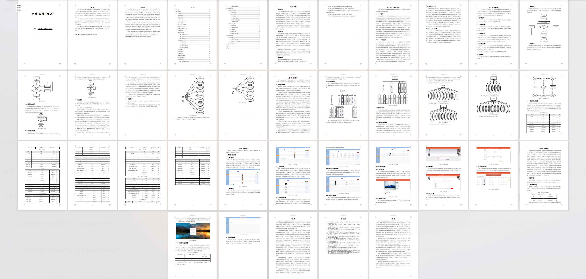
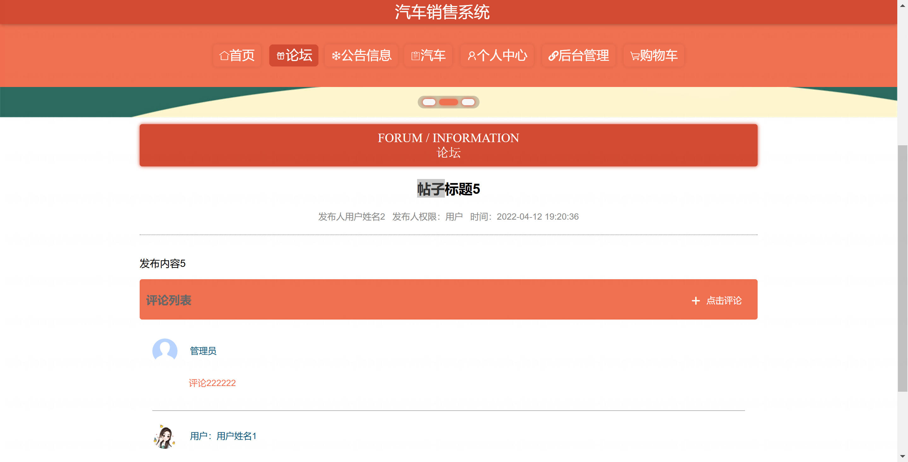
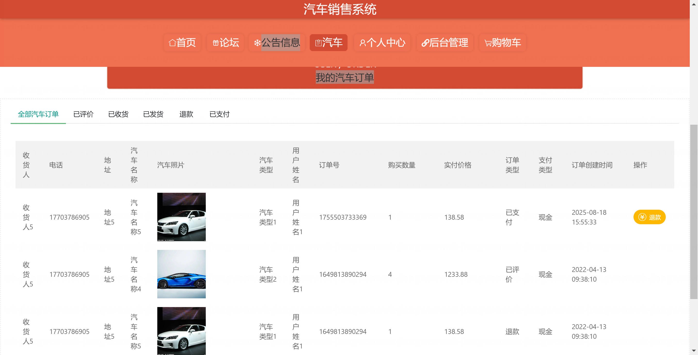
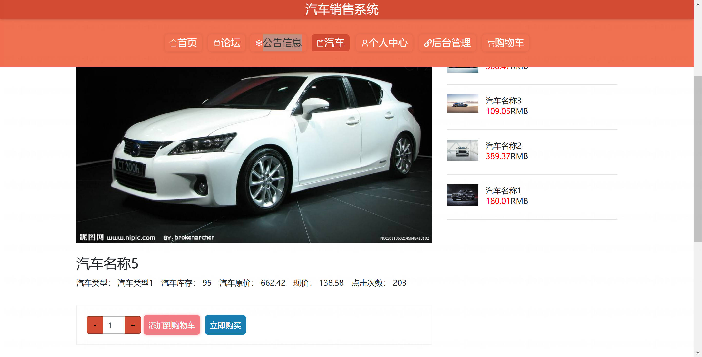
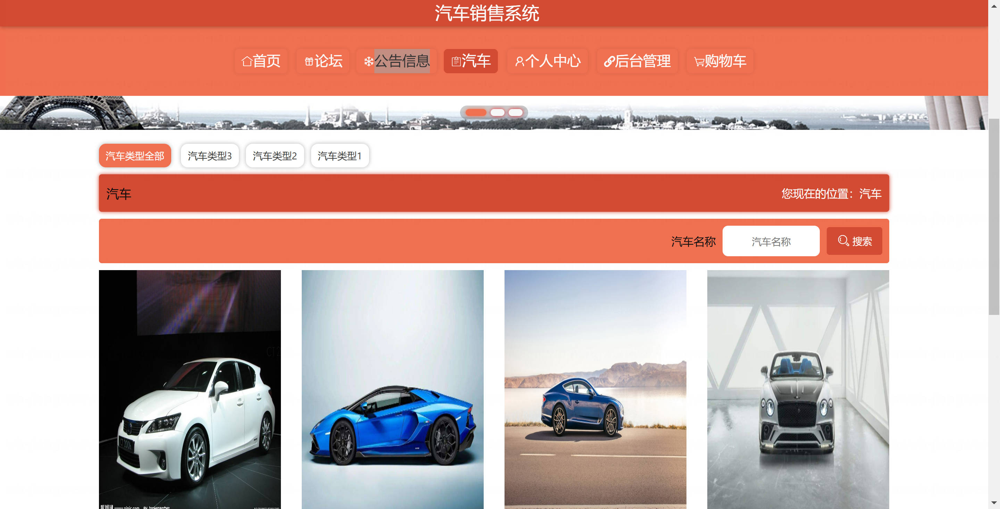
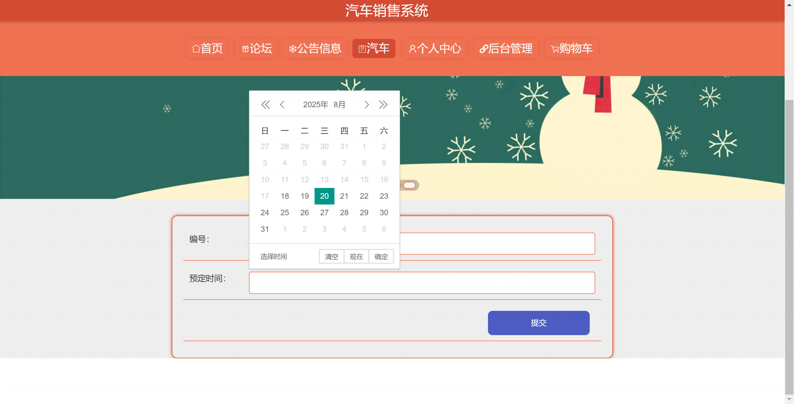
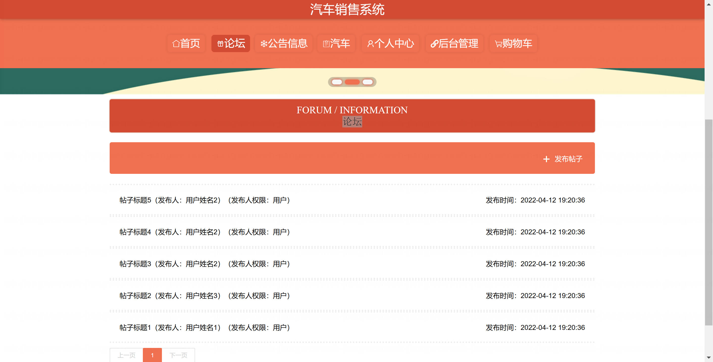
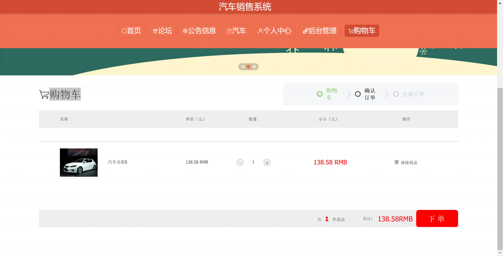

<h1 align="center">基于Spring Boot + Vue 的汽车销售系统系统【带论文】</h1>

- <b>完整代码获取地址：从戎源码网 ([https://armycodes.com/](https://armycodes.com/))</b>
- <b>技术探讨、资料分享，请加QQ群：692619798</b>
- <b>作者微信：19941326836  QQ：3645296857</b>
- <b>承接计算机毕业设计、Java毕业设计、Python毕业设计、深度学习、机器学习</b>
- <b>选题+开题报告+任务书+程序定制+安装调试+论文+答辩ppt 一条龙服务</b>
- <b>所有选题地址 ([https://github.com/Descartes007/allProject](https://github.com/Descartes007/allProject)) </b>

## 一、项目介绍

### 基于 Spring Boot + Vue 的汽车销售系统，系统角色为 管理员 与 普通用户，主要功能如下：
### 管理员（后台）：
- 基本操作：登录、修改密码、获取/修改个人信息、登出
### 用户管理：查看/新增/编辑/删除用户、分页与条件筛选、重置密码、获取session信息
### 汽车管理：汽车新增/编辑/删除、分页/列表/详情、上下架、批量导入、类别字典管理
- 订单管理：订单分页/列表/详情、下单、发货、确认收货、退款处理、查看/回复评价
- 试驾预约管理：试驾申请列表、审核/处理、详情查看
- 评价与论坛管理：商品评价管理、论坛帖子管理（CRUD、查看详情）
### 公告/新闻管理：发布/编辑/删除/列表/详情
- 收货地址与购物车管理：查看/管理用户地址与购物车记录
### 普通用户（前台）：
- 账号：注册、登录、登出、修改密码、个人中心信息查看/修改
- 商品浏览：汽车分类浏览、搜索筛选、详情查看、轮播图展示
- 购物流程：加入购物车、购物车管理、下单、支付（前端支付页）、查看订单状态、申请退款、确认收货、评价
- 试驾预约：提交试驾申请、查看预约状态
- 评价与论坛：发布/查看评论与帖子
### 地址管理：新增/编辑/删除收货地址、设置默认地址

## 二、项目技术

- 编程语言：Java（后端）
- 项目架构：B/S

## 三、运行环境

- JDK版本：1.8及以上都可以
- 操作系统：Windows7/10、MacOS
- 开发工具：IDEA、Ecplise、MyEclipse都可以

## 四、数据库配置文件

- npm版本：6.14.13及以上都可以
- Redis版本：3.2.100及以上都可以
- 文件名：application.yml
- 编码类型：utf8

## 论文截图

## 系统截图

